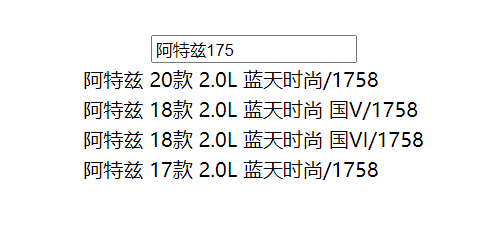
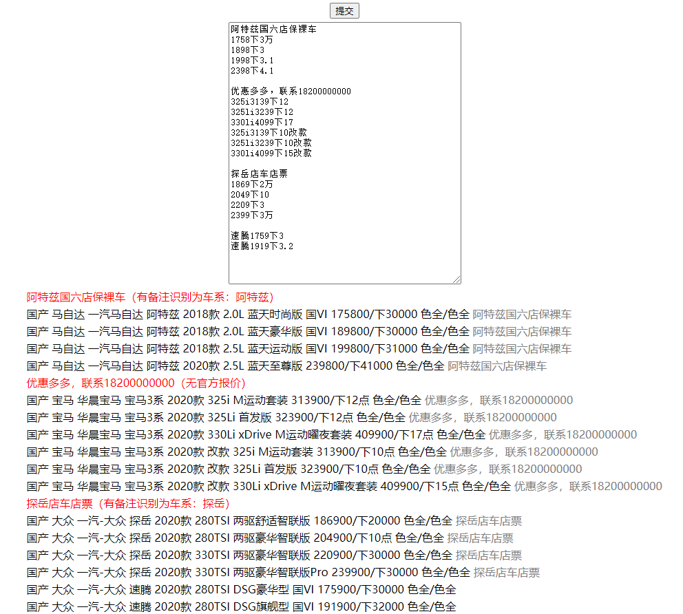
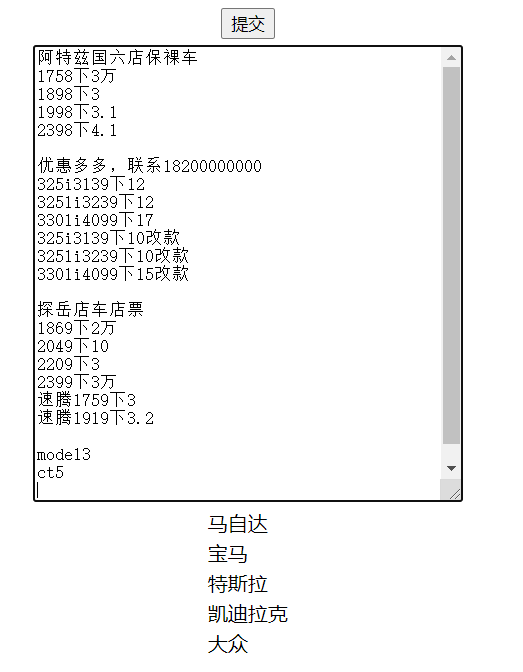

基于elasticsearch的车信息联想、车型术语解析、品牌识别

车型车系数据，存储在内嵌的h2数据库中，数据库文件myh2.mv.db，需要先在es中建立索引
车信息联想、品牌识别建立索引：http://localhost:8080/suggest/indexSuggest.json

车型术语批量解析建立索引：http://localhost:8080/batchParse/indexParse.json

测试页面
http://localhost:8080/

##### 车信息联想试例

##### 车型术语批量解析试例，灰色部分是备注

##### 品牌识别试例

